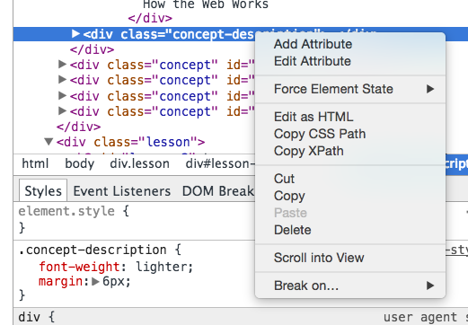
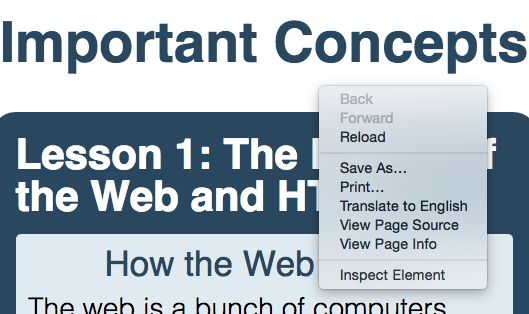
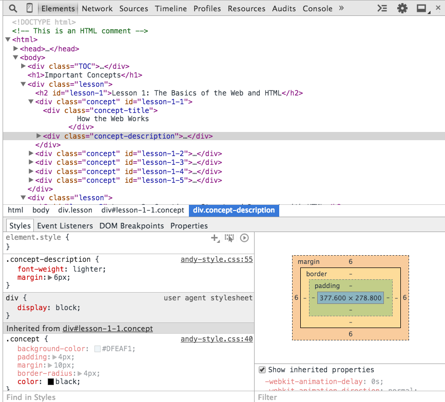
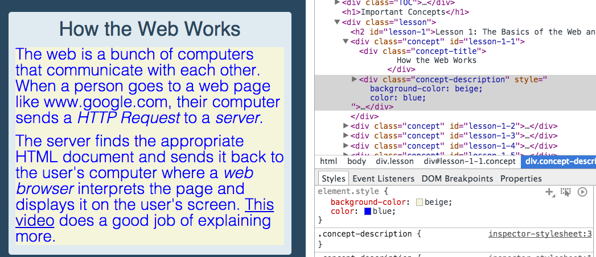

Introduction to Google Chrome Development Tools
==========================================

Here is a link to the [Office Hours Video][OH]

#What We Will Learn

  - Understand what Chrome Development Tools (Dev Tools) is
  - Learn how to access Dev Tools in Chrome
  - Inspect a website by 
    - Navigating HTML elements in a website
    - Explore an element and understand how to navigate to any element in Dev Tools its contents and its style
    - Dynamically play around with the element and change the content of the element and its style

##Google's Chrome Developer Tools

Otherwise known as "Dev Tools" in the programming community, Dev Tools gives developers the added power to dive under the "hood" of what the browser is doing whenever the browser renders a page. Please note that any HTML changes we make in Dev Tools will not get saved to our actual files. 

If we want to reset the HTML and CSS of the website, we can simply refresh the browser to load the original code again. Therefore do not be afraid to experiment and play around with the code in Dev Tools!

We will be using Chrome and if you want to follow along, please install Chrome on your computer [here][chrome_download]

##Transferring Andy's Codepen to the Browser

Throughout Stage 0 and Stage 1, we see Andy's example code [here][andys] that contains his Stage 0 and Stage 1 notes. We will be exploring this website using Chrome's Dev Tools to understand how to navigate the elements and manipulate an element's styling.

We first export this code from Codepen and open this website with our browser.

##Accessing Dev Tools

Once the website is open, we access Dev Tools by clicking on the "Hamburger" icon that appears on our upper right hand side, then click "More Tools" and then click "Developer Tools"

A new pane pops up that features shows Chrome's Dev Tools. We will just be covering the "Elements" feature of Dev Tools to help us explore our HTML elements.

The "Elements" tab appear in this screenshot in the top middle of this picture. If Dev Tools appear at the bottom of your screen: 

We can click on the square icon to the left of the "x" icon to shift Dev Tools to the right hand side of our screen

##Navigating HTML Elements

In the "Elements" panel, Dev Tools shows us the HTML code that is rendering our page live to the left of our browser. This view is a powerful view because we can literally navigate all of our events and expand and contract our elements similar to a tree. At any point in time, we can choose an element that we want to inspect and Chrome will highlight the element in the left hand side:

As we can see, we are selecting the div tag with class "concept-description" and Chrome is highlighting the actual element in the left panel. If we want to select another element and want Chrome to display that particular element in the view on the left-hand side, we right click on our target element and select "Scroll to View"

Like wise, if we are scrolling inside our view and want to inspect this element in Dev Tools, we right click on the element and click "Inspect Element"

##Inspecting and Changing an Element's Style

Notice in the lower right hand corner of the screen that there is a series of boxes with orange, beige, green, and blue boxes. That is actually the box model for our selected element. Remember from our course that all HTML elements can be treated as a series of rectangles that we are putting next to each other on a page.

This model gives us crucial information about the actual box layout of the element such as padding, border, margin, width, and height. The box is interactive as well and we can double click on any area of the box to change the appropriate sizing of our element.

Moving on to the lower left hand panel, we see the "Styles" panel that shows all of the CSS styles that controls how our browser renders our selected element. This is where we can play around with the CSS styles and dynamically change the appearance of our selected element.

We can add additional styles to the specific element by scrolling to the top in our Styles panel until we see `element.style {` and click the box that contains `element.style {`.

We then proceed to add in our custom CSS properties similar to how we would add CSS properties in our text editor. In this case, we added `background-color` and `color ` to our selected element.

We can scroll down to look at the other CSS styling that affects this element's styling such as the class "concept-description". We can actually change that class's CSS declarations to modify all elements that have the class "concept-description".

##Changing an Element's Content

If we want to change actual content of our selected element, we need to go back up into the "Elements" panel and right click on the element and choose "Edit as HTML".

We can then edit all of the content inside this element like how we would edit this element inside our text editor. For instance, we can edit the HTML and replace the text with one paragraph that says:

> Dev Tools rocks and I can change anything that I see in the browser with this tool!

To finish editing our HTML, we simply click outside of the editing area and Chrome changes our content of our selected element!

##Summary

Dev Tools is a development tool that let's developers inspect our web page in more detail and allow us to manipulate the contents of our website live. We're now able to explore our HTML elements with ease, explore its box-model, and change the styling and content of any element that we want. This "Elements" panel is invaluabe for developers because it gives developers instant feedback and exploratory ability to play around with styling and content before they code the styling and content in their HTML and CSS files.

##Questions and Answers About Chrome Dev Tools

Below is a questions and answer from the Live Office Hour session that involve Chrome Dev Tools

- "Regarding Chrome Dev tools, are there online tutorials where one can walk through a project to further our learning?"

   Google's Chrome Dev Tools webpage has a comprehensive tutorial on using Chrome Dev Tools [here][devtool]. The tutorial is comprehensive, but a little dense. We also recommend you tune into Office Hours as well and request for more walkthroughs such as this walk through here. Please post on the forum and request for more project walk throughs and ask everyone to like your suggestion and the coach team can prioritize the content that you want. 
   
   We also recommend you dive in and explore your own Stage 1 code and play around with inspecting your elements and styles as well as try to change the styling of your favorite websites such as the Instagram website that we presented in this session.

[chrome_download]: https://www.google.com/chrome/browser/desktop/
[andys]: http://codepen.io/AndyAtUdacity/pen/KweNKa?editors=110
[OH]: https://plus.google.com/events/clkm4umamn5he1bvna6dptqsvco?authkey=CO7I8p62gt3y9gE
[devtool]: https://developer.chrome.com/devtools#dom-and-styles
